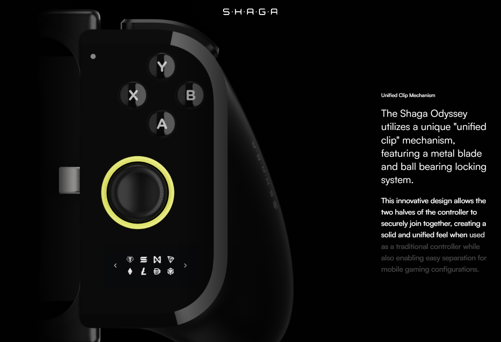

# Shaga

URL - https://www.odyssey.shaga.xyz/

**Rating**
| Aspect                      | Score        |
| --------------------------- | ------------ |
| Visual design and Aesthetic | 8            |
| Layout and Structure        | 8            |
| UX                          | 8            |
| Usability                   | 8            |
| Content                     | 7 (Hierachy) |
| Branding and Creativity     | 8            |

- [Shaga](#shaga)
- [Visual design and Aesthetic](#visual-design-and-aesthetic)
- [Layout and Structure](#layout-and-structure)
- [UX](#ux)
- [Usability](#usability)
- [Content](#content)
- [Branding and Creativity](#branding-and-creativity)

---

# Visual design and Aesthetic

**Design style** - **modern & minimalist design**

I call this modern design it's because the usage of 3d object.
And for the minimalist part, because the pages is straigt to the point, selling the item.

**Color scheme** - black & white (which suits minimalist design which use gentle color / black & white), with a bit of accent color (**neon**)

**Typography**
Satoshi (body)- https://www.fontshare.com/?q=Satoshi

**Images & graphic**
Lot of uses of 3d object, let user immerse with the product.

---

# Layout and Structure

1. **Header and Navigation**
- The header can be reached any place on the web, when scrolling down it will hide, the header except the company name (which give user a sense of what website is it).
- The navigation shows the toc of the websites and the main goal of the website (which is selling the product)

2. **Spacing and Whitespace**
- For the spacing, it is pretty far apart from each element, giving comfort feeeling to user.
- Overall the whitespaces utilized really good, there is only a few words to read in one eyeside view, which let user concentrate on what it needed to know.

3. **Responsiveness**
One the mobile, instead of left-right for image-text. It uses text-image vertically. This is how user can easily read the text

---

# UX

1. **Clarity/Goal**
- The main goal of the website is to sell this controller, which I think is very straigt forward
  - 1. price on the navigation
  - 2. specs and features, lastly q&a

1. **Flow**
- Shows user the item in big picture with name first
- starts to tell the features of the product
- more detailed features if user is interested
- q&a section
- footer
- consistantly showing the price and buy cta across the sites

3. **Consistency**
- the layout is consistency, so user eye doesnt need to keep finding where to see, it's a pleasure experience in this websites

---

# Usability
1. **Speed**
2. **Accessibility**

---

# Content
1. **Copy writing**
- Formal tone, it gives us premium feeling.

2. **Information Hierarchy**
For me, the hierarchy isn't so obvious, like dont have much idea about what the section is for.

For example, above image it's `Adaptive Phone Grip`.
But it uses smaller font size instead of higher in hierarchy, makes audience don't know what is it in the first sight.
Which is bad because it lets user to do **cognitive thinking**.

---

# Branding and Creativity
1. Brand alignment
First of all, the whole websites give me a feeling of it is selling a very premium controller.
   1. The color selection is perfect (black and white - Minimalist), which is suitable for brands that **aimed to be luxury**
   2. The typeface is also perfect (**sans-serif**), which is most used in modern websites.
   3. The image is top, for me - the most important aspect that let this websites looks so beautiful it's because the selection of the image. Every image is selected carefully to give user know what is it
   4. Also with the animation, it let's user immerse in it.
1. **Creative Elements**
   1. The rotating image on hero
   2. Text appearing animation and **color radius** (as you can see the middle appears brighter)
   3. Using good video animation on some elements, reduce 3d rendering performance issue