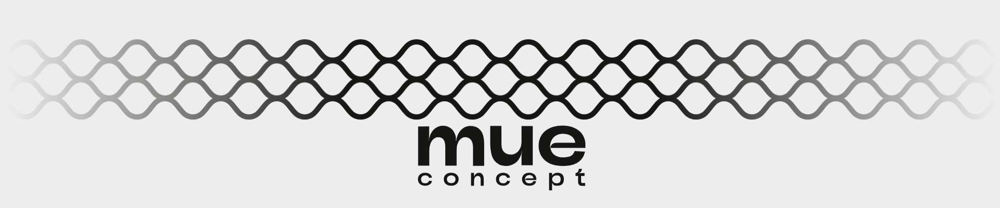
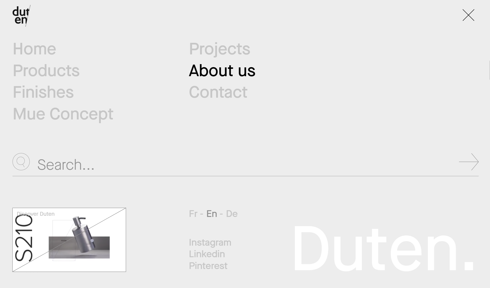
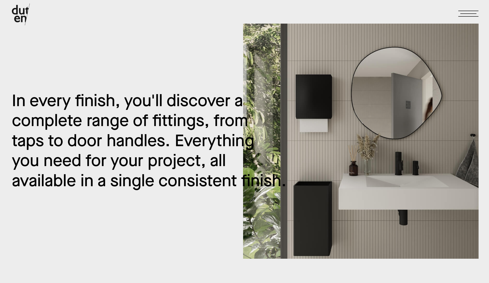
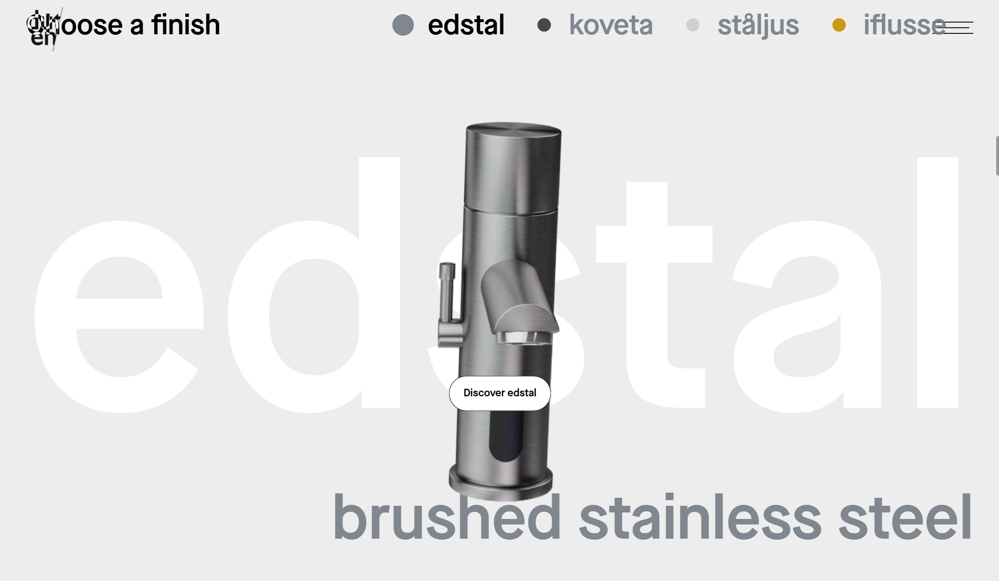
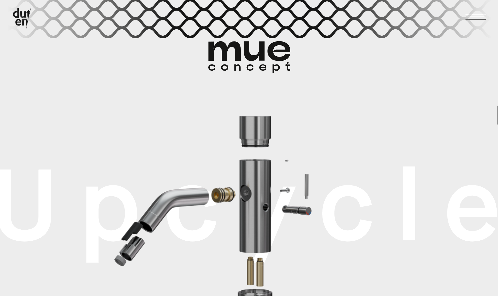

# SiteName

URL - https://www.duten.com/en/
Date - 2024/11/3

**Rating**
| Aspect                      | Score |
| --------------------------- | ----- |
| Visual design and Aesthetic |       |
| Layout and Structure        |       |
| UX                          |       |
| Usability                   |       |
| Content                     |       |
| Branding and Creativity     |      |


- [SiteName](#sitename)
- [Visual design and Aesthetic](#visual-design-and-aesthetic)
- [Layout and Structure](#layout-and-structure)
- [UX](#ux)
- [Usability](#usability)
- [Content](#content)
- [Branding and Creativity](#branding-and-creativity)


---

# Visual design and Aesthetic

**Design style**
**Minimalist** for sure for the first sight.

It's not flat, because it uses 3d object (It's video here also)
- several website uses 3d already, suitable for luxury brands.


**Color scheme**
Black & White - that's starter pack for minimalist design, So far not yet seen a minimalist website with special primary color.

**Typography**

Maison Neue (Paid) - https://www.myfonts.com/collections/maison-neue-font-milieu-grotesque

- looks really good on minimalist website!


**Images & graphic**
- Uses really **high quality image & motions**, which makes this website looks very high-end
- Also the graphic, although have no connection, but still fire



---

# Layout and Structure


**Header and Navigation**
- Typical header navigation, but it's minimal, user need to click to look inside

Theres one thing that makes this header look more luxury is the animation.
- Nav selection text (bottom-up animation)
- Duten word also (bottom-up with alternate character)
- **Search line from left to right animation** 

**Spacing and Whitespace**
It utilize the whitespace really good.
- Every viewing port only have one important sentences to make user concentrate on it
- Also it uses animation for the text so it wont look boring (parallax, bottom-up, enlarging)

For crowded place, like the menu, it uses color to make it up.


**Responsiveness**
It's good.
flex column to flex row.

---

# UX

**Clarity/Goal**
- To market their luxury product

**Flow**
- Intro - "Quality and Minimal design"
- Story of the product

- Showcase more product (3d), really cool!

- After some sick showcase, give even cool showcase! (Gain more attraction)

- Testimonial (**Last power to gain reputation**)
- More other products.

**Consistency**
10/10


---

# Usability

**Speed**
10/10

**Accessibility**
- multiple language

---

# Content

**Copy writing**

**Information Hierarchy**


---

# Branding and Creativity

**Brand alignment**

**Creative Elements**
- Used a lot of **parallax scrolling effect** for text and images
```json
transform: translate3d(0px, -10.0599px, 0px);
```