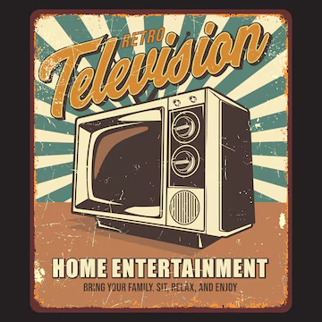
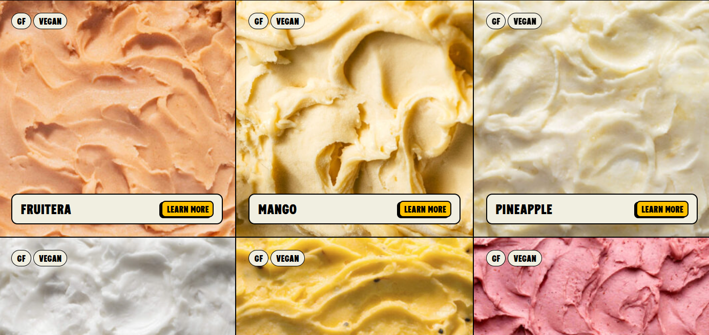
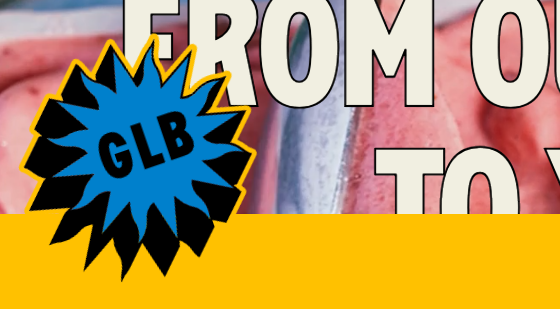
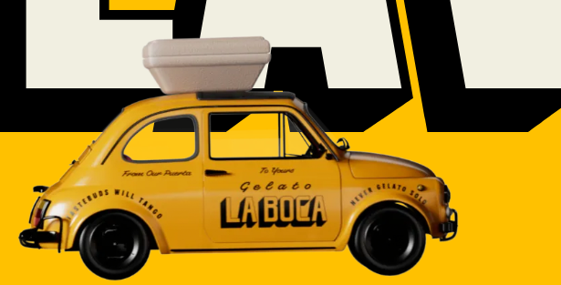
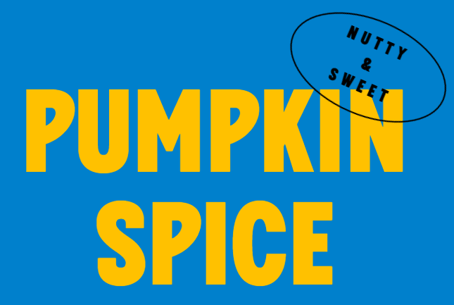
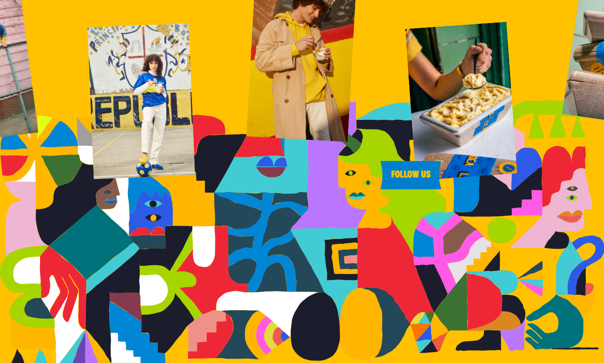

# GelatoLaboca

URL - https://gelatolaboca.com/

**Rating**
| Aspect                      | Score |
| --------------------------- | ----- |
| Visual design and Aesthetic |       |
| Layout and Structure        |       |
| UX                          |       |
| Usability                   |       |
| Content                     |       |
| Branding and Creativity     |      |

- [GelatoLaboca](#gelatolaboca)
- [Visual design and Aesthetic](#visual-design-and-aesthetic)
- [Layout and Structure](#layout-and-structure)
- [UX](#ux)
- [Usability](#usability)
- [Content](#content)
- [Branding and Creativity](#branding-and-creativity)

---

# Visual design and Aesthetic

**Design style**
Ok, this is a new design look for me.
By the appearance of it, I would say it is style of **Vintage**
That's because the color selection, the border, the animation, the typeface suits the Color of vintage.

**Color scheme**

Primary - WashedYellow
Secondary - Washed Blue

Color harmony - split complementary

**Typography**

The Bystander (Paid Font) - https://globalfonts.pro/font/the-bystander-collection

It is a sans-serif fonts, which is not as expected serif fonts. But it uses bold, so it makes pretty good sense.

**Images & graphic**

Welp, Image is really important, it makes me want to buy their icecream....

Shown on the gif above, it uses a stop motion gif on hero section which immediately let user **feels vintage**.

And some elements

- Blend really nicely, these oval shapes.

- some abstract graphics (**Art deco**) blend inside vintage design.

---

# Layout and Structure

**Header and Navigation**
- It also uses scroll up to show the header (**2/2**)
- order now on header (Good for engaging user to buy throughout the scrolling)
- When open the menu, instead of ordinary menu, it drops the links by blocks. Which blend with the site aesthetic (**geometric**)

- but the performance isn't too great.

**Spacing and Whitespace**
- The spacng is good, nothing too crowded that is hard to read.
- Given good white space to differentiate, Easy to know what to read.

**Responsiveness**
- Yes

---

# UX

**Clarity/Goal**
- To **sell their gelato**
It's obvious, so it's good websites, also not feeling disgusted, good take on the pushing sale.

**Flow**
- Intro - "For families and foodies"
- Story of the store (What it does)
- Some picture of their store
- Tells difference between gelato & ice-cream
  - Gelato (More milk to cream), which create softer feeling.
- Starts to **push sales**
- More push sales
- Footer end with more order icon

**Consistency**

I mean, it feels like a piece, so consisteny is on point.

---

# Usability
**Speed**
- Normal scrolling is good
- But the menu selecting item is causing lags

**Accessibility**
- No

---

# Content
**Copy writing**
- Casual, feels friendly

**Information Hierarchy**
- Good, easy to know what topic im in.

---

# Branding and Creativity
**Brand alignment**
- **Sunshine and Happiness**
- **Playful**

Yeah, this design suit with it's brand.
Makes it feel really hand made which can be sold expensively haha.

**Creative Elements**
There's a lot of element i can learn from this website!

1. Moving object while scrolling

2. Animated Text
   1. Fade in one by one
3. Interactive cursor