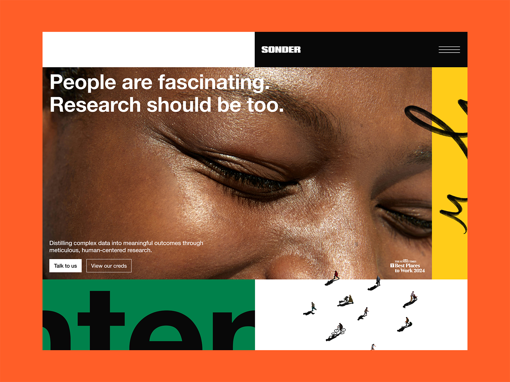

# What's the differences between minimalist and flat design?

// So these two design confuse me alot

// In one sentences
*minimalist design emphasizes simplicity in both **content** and **layout***
*flat design focuses primarily on the **visual appearance** by eliminating depth and complexity*

**flat design can be minimalist, but not all minimalist designs are flat.**

---

**Minimalist design characteristic**
(Focus on core message, user feel calm - less cognitive loads)
1. neutral color
2. white space (To create focus)
3. minimal ui
4. prioritize functionality (Less is more)
5. no shadows, 3d
6. layout asymmetrical or grid-based, gives sense of calm

**Flat design characteristic**
(Improve usability, prioritize speed)
1. bold color (playful)
2. no emphasize on spacing (often compact)
3. flat ui (doesnt concentrate on minimal element)
4. No prioritize on any functions
5. elimates shadows, 3d from skeuormophic
6. layout are often functional and straigtforward

---
