# Design styles
- [Design styles](#design-styles)
  - [Swiss style / International Typography style](#swiss-style--international-typography-style)
  - [Minimalist design](#minimalist-design)
  - [Brutalism design](#brutalism-design)
  - [Skeuormophic design](#skeuormophic-design)
  - [Flat design](#flat-design)
  - [Neumorphism design](#neumorphism-design)
  - [Art deco design](#art-deco-design)
  - [Futuristic / Cyberpunk design](#futuristic--cyberpunk-design)
  - [Vintage / Retro design](#vintage--retro-design)
  - [Typography first design](#typography-first-design)

---

## Swiss style / International Typography style
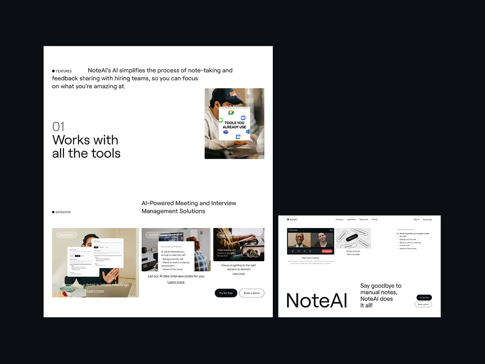

**Origin** - Switzerland in 1950's

**Characteristic**
- Grid layout
- Clear, readable typeface (sans-serif)
- White spaces
- Minimal ornamentation (decoration)
- Asymmetrical composition

**Impact on web design**
- Emphasizing in structure and clarity
- Modern design system like Material UI

---

## Minimalist design

**Origin** - Inspired by Japanese design principle and modernist art movement (**LESS IS MORE philosophy**)

**Characteristic**
- Focus on simplicity
- Use **neutral color (natural color)** and ample white space
- Minimal text and UI elements
- Only **essential** features, with no distraction
- *"Every element serves a clear purpose—if it’s not needed, it’s removed"*

**Impact on web design**
- Common in portfolio website and **luxury brand**
- Reduces cognitive load for user

---

## Brutalism design

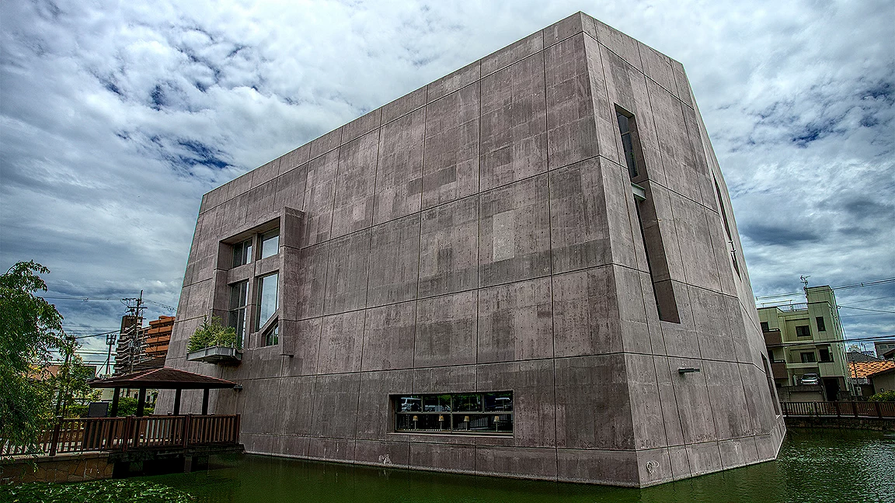
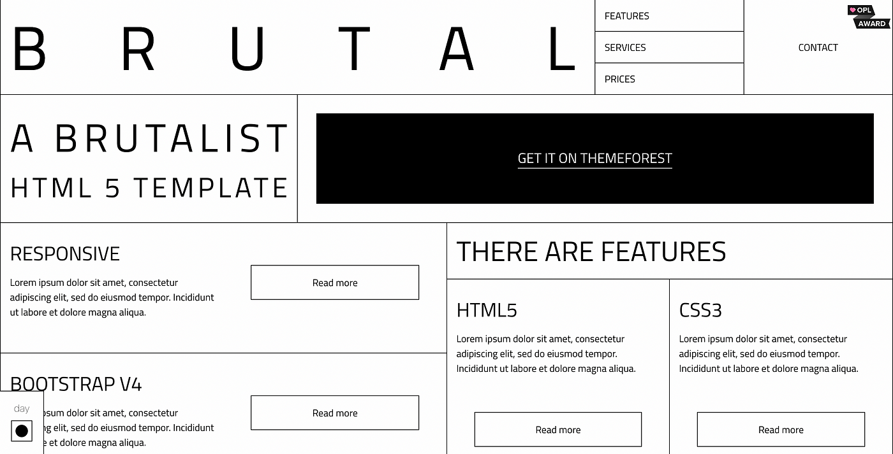

**Origin** - Inspired by Brutalist architecture, characterized by rawness and honesty.

**Characteristic**
- Raw, unpolished look with minimal styling
- **Hard edges (No radius)**, rigid structure, and **limited use of color (Nature color - cement)**
- Often intentionally "ugly" or unconventional
- Use **default system font** and **basic HTML structure**

**Impact**
- Appeals to niche audience who value authencity
- Used in **experimental projects** or **personal websites**
- Blogs or portfolio.

---

## Skeuormophic design

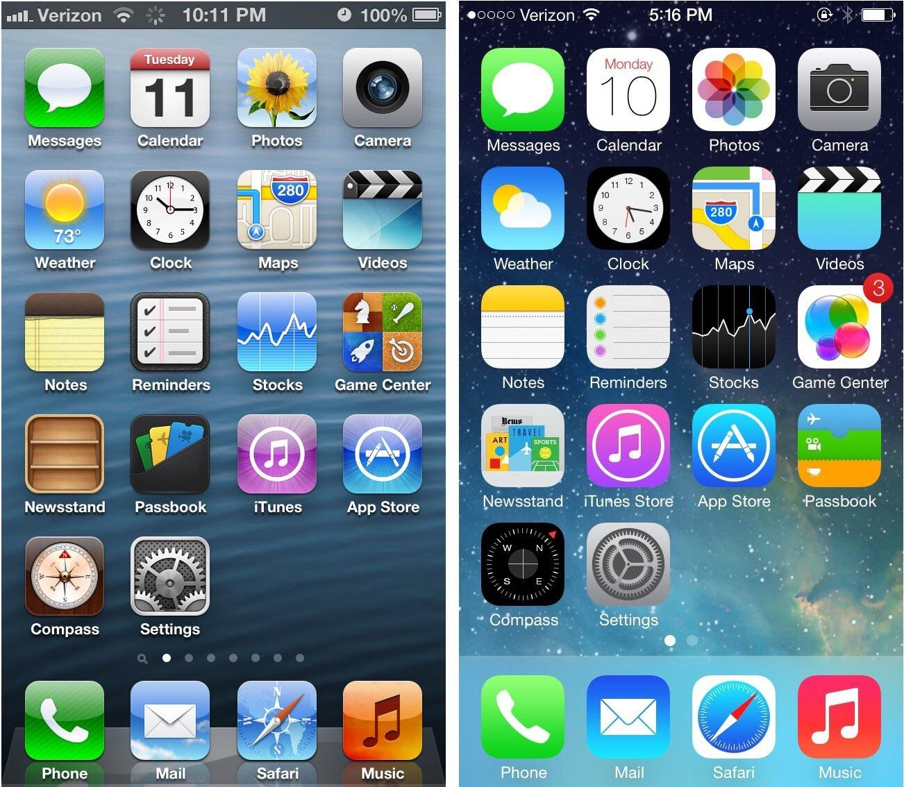

**Origin** - Popular in early "20s", when digital interfaces mimicked real-world object (Because need to let user know what thing is it. Can think of everyone is not tech savvy)

**Characteristic**
- **realistic texture** and **shadow** mimic real object
- Elements resemble real object
- Heavy use of **gradient** and **3d object**

**Impact**
- Fell out of favor

---

## Flat design

**origin** - A response to skeuormophic design in the mid-2010s (**Aesthetic simplicity**)

**Characteristic**
- Simple, **flat icons and UI elements**
- **Bold colors (playful color)** and **no depth effects** (like shadow and gradient)
- Emphasis on functionality over decoration

**Impact**
- Common in dashboard and app

---

## Neumorphism design

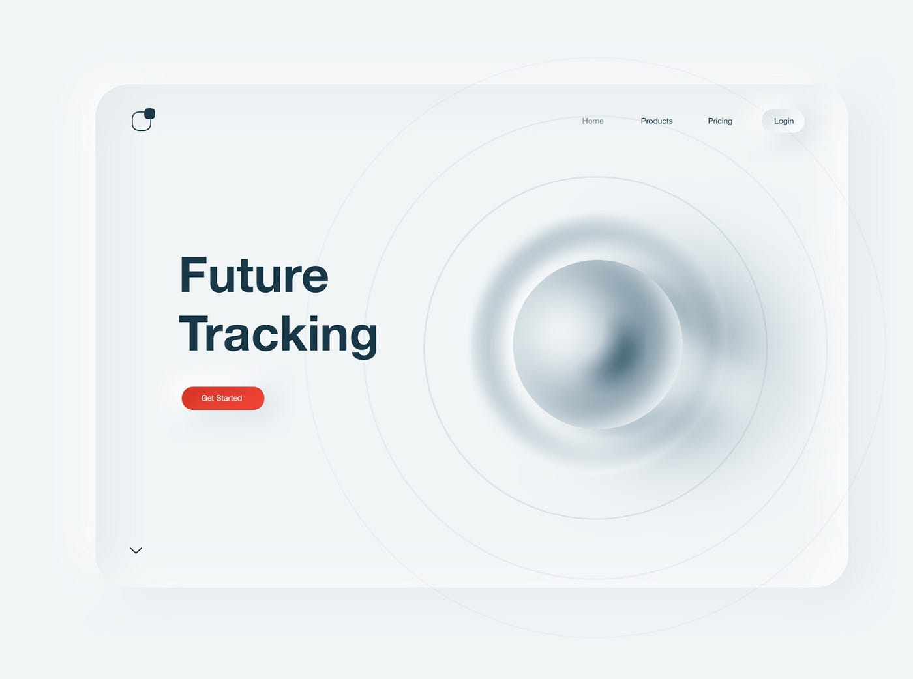
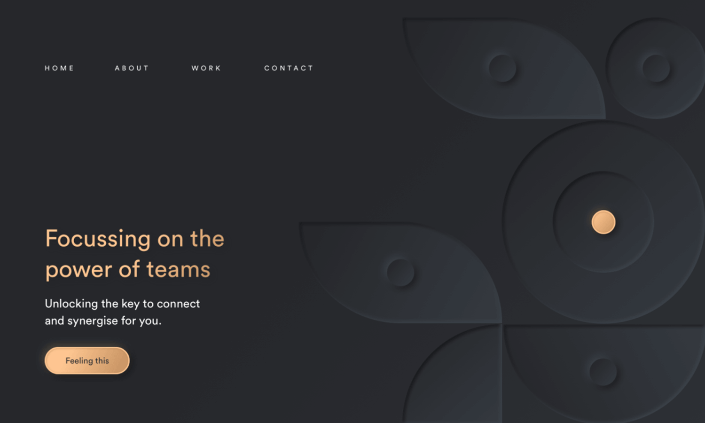

**origin** - A blend of skeuormophism and flat design principle

**Characteristic**
- **Soft shadow** and **highlights** that create a **subtle 3D effect**
- **Minimalistic color scheme**
- **Rounded corner** and **smooth gradient**

*Instead of hard shadow that looks really real, and bold color, no depth effect, hard gradient. Overall it's flat but use some to create subtle 3d effects*

**Impact**
- Works well for user interface like buttons or cards
- Modern **fintect apps** and **dashboard**

---

## Art deco design

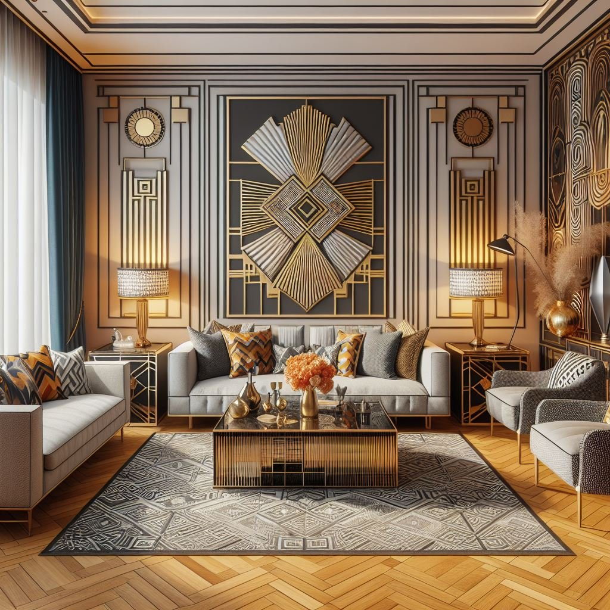
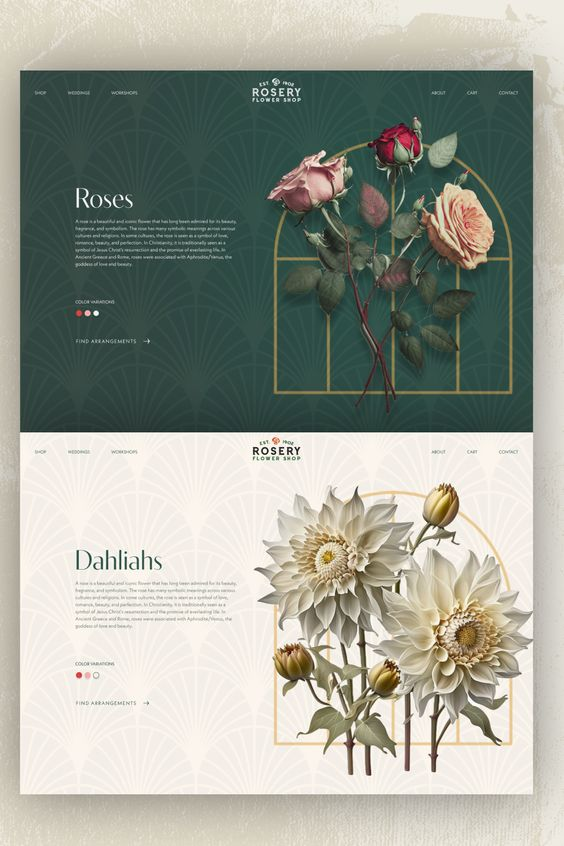

**origin** - Emerged in 1920s-30s as a decorative art style.

**Characteristic**
- **Geometric shapes** and **pattern**
- **Luxurious color pallete** (gold, black, metallic)
- **Bold typography**

**Impact**
- Used in high-end fashion and jewelry websites

---

## Futuristic / Cyberpunk design

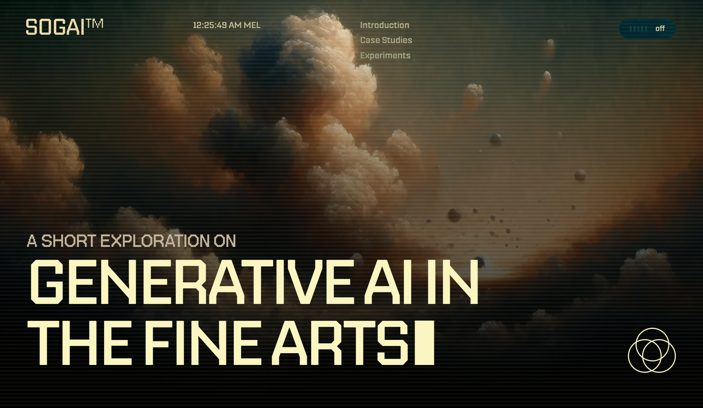

**origin** - Inspired by sci-fi media and futuristic aesthetic

**Characteristic**
- Dark theme with neon color
- Glitch effects and distorted font
- Dynamic animation and 3d element

**Impact**
- Popular in gaming sites or experimental portfolios
- Websites promoting **tech related** events.

---

## Vintage / Retro design

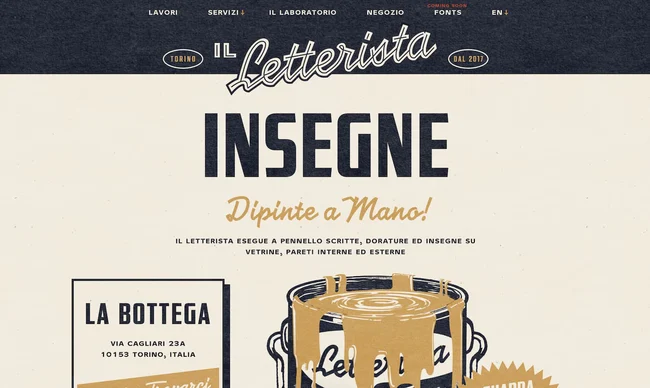

1950s design
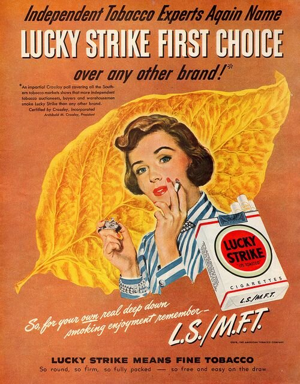

1980s design
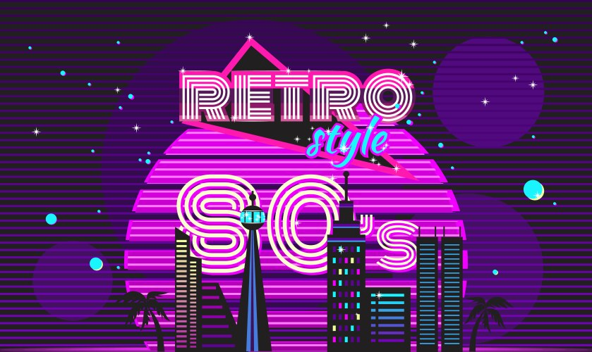

**origin** - Draws inspiration from past decades (eg: **1950s** or **1980s** design)

**Characteristic**
- Use nostalgic color palletes
  - By mean of nostalgic color palletes there are (**muted**, **earthy** color)
- Typography inspired by vintage poster
- Grainy texture and retro icons

**Impact**
- Appeals to user with sense of nostalgic
- **Cafe's**, **record stores**, or themed blog

---

## Typography first design

**origin** - Focuses primarily on typography the main visual elements.

**Characteristic**
- Bold, oversized fonts
- Minimal use of images or graphics
- Often black and white or monochrome pattern

**Impact**
- Seen in experimental and creative portfolio
- Web agencies or artistic project website
